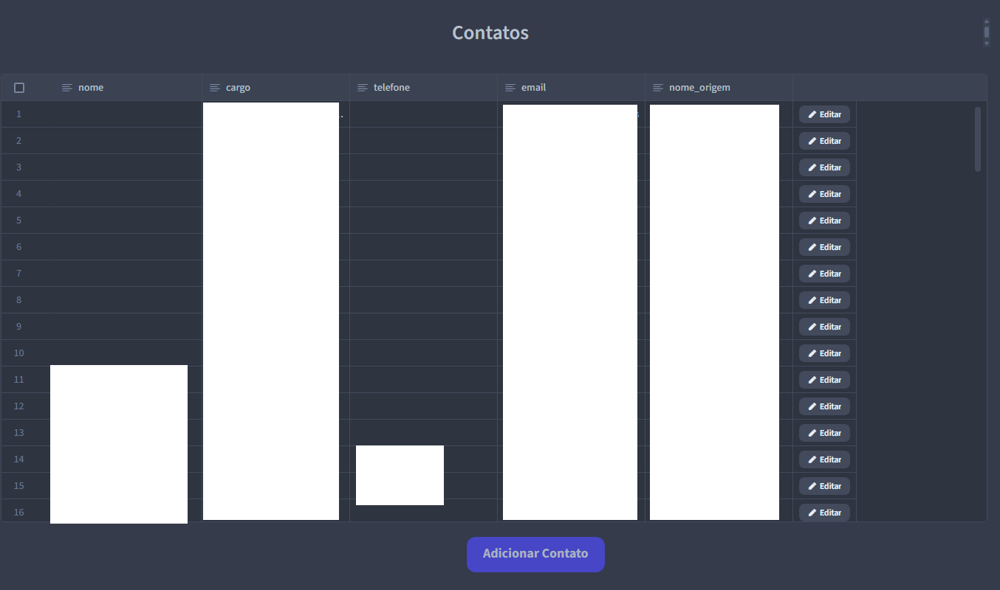
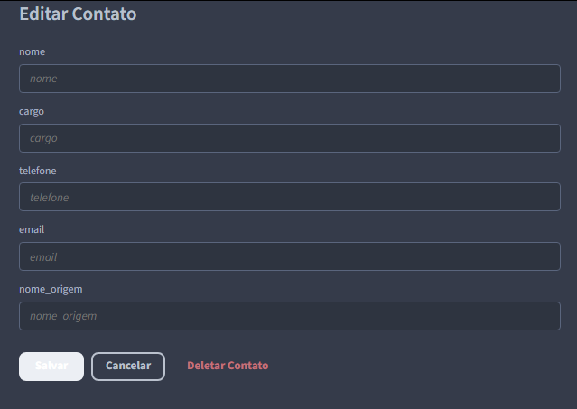
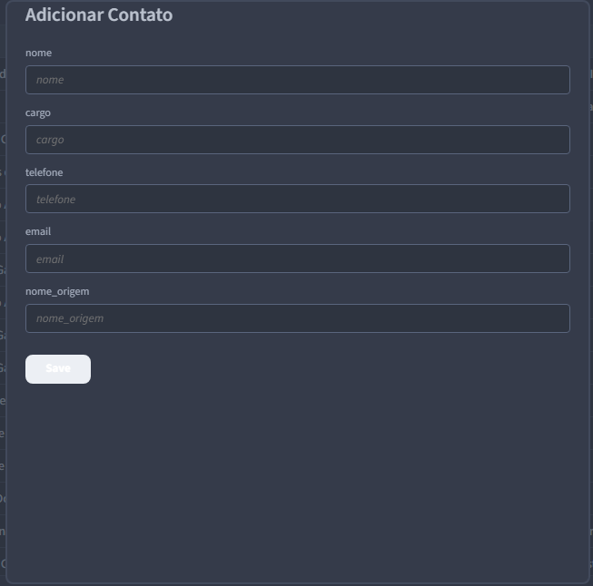

# 📋 Agenda de Contatos Institucionais com Supabase e Budibase


Este projeto é uma aplicação web criada para substituir uma planilha de contatos complexa. A solução foi desenvolvida utilizando a plataforma low-code **Budibase** como interface de usuário (frontend) e o **Supabase** como banco de dados (backend), proporcionando um sistema seguro, eficiente e fácil de usar.

O objetivo principal foi transformar uma lista de contatos estática e frágil em uma aplicação dinâmica com funcionalidades de busca, edição controlada e múltiplos níveis de acesso para usuários.

## ✨ Funcionalidades Principais

-   **Gerenciamento Completo de Contatos (CRUD):** Adicione, visualize, edite e delete contatos através de uma interface intuitiva.
-   **Categorização por Origem:** Contatos são classificados em grupos maiores (ex: Associações, Autarquias, Autoridades Militares) para melhor organização.
-   **Busca Inteligente:** Um campo de busca que filtra em tempo real a tabela de contatos, pesquisando em múltiplas colunas (nome, cargo, e-mail, origem) sem diferenciar maiúsculas de minúsculas.
-   **Controle de Acesso Baseado em Permissões (RBAC):** A aplicação conta com três níveis de acesso de usuário:
    -   **Leitor (`leitor`):** Apenas visualiza os contatos.
    -   **Editor (`editor`):** Pode visualizar, adicionar e editar contatos.
    -   **Administrador (`admin`):** Permissão total, incluindo a capacidade de deletar contatos.
-   **Segurança de Credenciais:** As chaves de conexão com o banco de dados são gerenciadas de forma segura através de "Bindings" (variáveis de ambiente), garantindo que nenhuma informação sensível seja exposta no código-fonte.

## 🛠️ Tecnologias Utilizadas

-   **Frontend (Interface):** [Budibase](https://budibase.com/)
-   **Backend (Banco de Dados):** [Supabase](https://supabase.com/) (PostgreSQL)

## 🚀 Como Configurar e Rodar o Projeto

Para rodar este projeto, você precisará de uma conta no Supabase e uma no Budibase.

### 1. Configuração do Backend (Supabase)

1.  Crie um novo projeto no Supabase.
2.  Guarde bem as credenciais do seu banco de dados (Host, Nome do Banco, Usuário, Senha).
3.  No seu projeto Supabase, vá para o **"SQL Editor"** e execute o script abaixo para criar toda a estrutura de tabelas necessária:

    ```sql
    -- Tabela para as Origens (Grupos Maiores)
    CREATE TABLE origens (
        id_origem SERIAL PRIMARY KEY,
        nome_origem VARCHAR(255) NOT NULL UNIQUE
    );

    -- Tabela para os Contatos
    CREATE TABLE contatos (
        id_contato SERIAL PRIMARY KEY,
        nome VARCHAR(255),
        cargo TEXT,
        telefone VARCHAR(100),
        email VARCHAR(255),
        nome_origem VARCHAR(255)
    );

    -- Tabela para os Usuários da Aplicação e suas permissões
    CREATE TABLE usuarios (
        id_usuario SERIAL PRIMARY KEY,
        email_usuario VARCHAR(255) NOT NULL UNIQUE,
        nivel_acesso VARCHAR(50) NOT NULL CHECK (nivel_acesso IN ('admin', 'editor', 'leitor'))
    );
    ```

### 2. Configuração do Frontend (Budibase)

1.  Crie uma conta no Budibase.
2.  No painel principal, use a opção **"Import app"** e selecione o arquivo de exportação `.budibase` deste projeto.
3.  Durante a importação, o Budibase irá detectar que a aplicação precisa de credenciais de banco de dados. Ele solicitará que você preencha os valores para os seguintes **"Bindings"**:
    -   `SUPABASE_HOST`
    -   `SUPABASE_DATABASE`
    -   `SUPABASE_USER`
    -   `SUPABASE_PASSWORD`
4.  Após fornecer as credenciais, finalize a importação.

## 👤 Uso da Aplicação

1.  **Publicar:** Dentro do editor do Budibase, clique em **"Publish"** para que a aplicação fique online.
2.  **Cadastrar Usuários:** Para que um usuário tenha uma permissão específica, seu e-mail e nível de acesso (`admin`, `editor` ou `leitor`) devem ser cadastrados manualmente na tabela **`usuarios`** no Supabase.
3.  **Convidar Usuários:** No painel de gerenciamento do Budibase, convide os usuários (com a permissão **"Basic"**) para que eles possam acessar a aplicação.


## 📸 Screenshots

### Tela Principal (Listagem e Busca)


### Formulário de Edição


### Formulário de Adição

